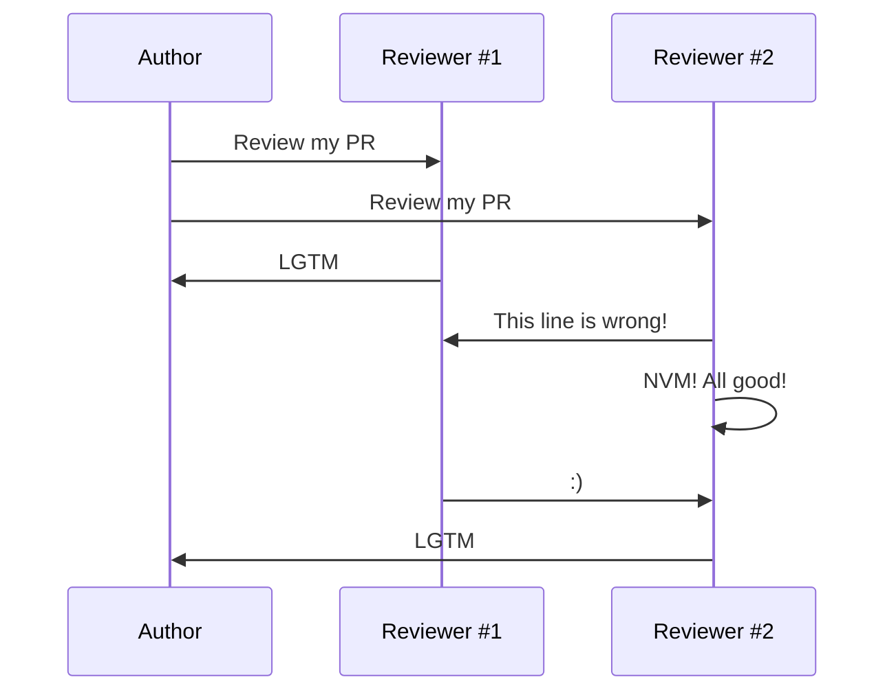
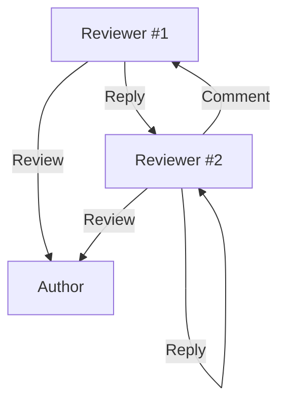

# Community detection in large open-source projects

## Analyzing scikit-learn contribution graph

  
    German Arutyunov 08.04.2022
  

---
layout: two-cols
class: my-auto
---

<template v-slot:default>

# GitHub Data

* Pull requests: 990
* Reviews: 18905
* Comments: 29077
* Contributors: 509

</template>

<template v-slot:right>

# Graph summary

* Directional homogeneous unweighted graph with self loops
* Nodes: 503
* Edges: 3182

</template>

---
layout: two-cols
---

<template v-slot:default>

# Communication

</template>

<template v-slot:right>

# Resulting Graph

</template>

---
class: my-auto
---

# Hypothesis

* H1: High clustering coefficient
* H2: Hubs with high degrees and centralities
* H3: Short average path length
* H4: Power-law like distribution
* H5: Few tight communities

---
layout: two-cols
---

<template v-slot:default>

# Clustering coefficient

Average clustering coefficient: 0.77

</template>

<template v-slot:right>

</template>

---
layout: two-cols
---

<template v-slot:default>

# Betweenness centrality and shortest paths

Average path length: 2.48

</template>

<template v-slot:right>

</template>

---
layout: two-cols
---

<template v-slot:default>

# Power law?

</template>

<template v-slot:right>

</template>

---
layout: two-cols
---

<template v-slot:default>

# Who are the hubs?

</template>

<template v-slot:right>

</template>

---
layout: image-right
image: /barabasi-albert.svg
---

# Barabasi & Albert Model

* Nodes: 503
* Edges: 3163

 

| Metrics          | Real | BA   |
|------------------|------|------|
| Avg. clustering  | 0.77 | 0.06 |
 | Modularity       | 0.29 | 0.26 |
| Avg. path length | 2.56 | 2.78 |
| Diameter         | 6    | 4    |
| Radius           | 3    | 3    |

---
layout: image-right
image: /modularity.svg
---

# Community detection

* Method: Louvain
* Number of communities: 8
* Modularity: 0.291

---
layout: statement
---

# Thank you for your attention!
